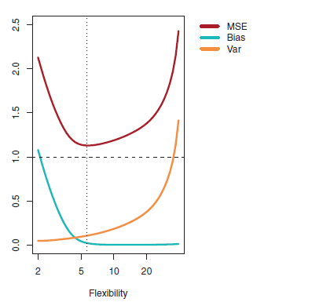

```{r setup, include=FALSE}
knitr::opts_chunk$set(echo = TRUE)
library(dplyr)
library(tidyr)
library(tidyverse)
library(glmnet)
```

## Problem 1 Regularization

We read the hitters dataset into a dataframe ad then apply Lasso and ridge regression to predict salary based on other parameters in the dataset. Note that all character (in this case same as categorical) fields are removed from the dataset prior to modelling.

The code to read the dataset and a function to run the glm model with shrinkage is presented below. Same function is used for ridge and lasso, with the alpha parameter set to 0 for ridge and 1 for lasso.
```{r cars}
run_regularization_model <- function(x, y, train, alpha) {
  # check if this is ridge or lasso
  if(alpha == 0) {
    reg_type = "Ridge"
  } else if(alpha == 1) {
    reg_type = "Lasso"
  } else {
    cat(sprintf("unsupported value for alpha %d, exiting\n", alpha))
    return;
  }
  
  # set the grid for a cross validation grid search for best lambda
  grid <- 10^seq(10,-2, length =100)
  
  # regression without CV
  mod <- suppressWarnings(glmnet(x[train ,],y[train],alpha =alpha, lambda =grid ,
                          thresh =1e-12))
  
  # cross validation to find best lambda
  cv.out <- suppressWarnings(cv.glmnet(x[train ,], y[train], alpha = alpha))
  # plot the cv output
  suppressWarnings(plot(cv.out))
  
  # lambda min is the best lambda
  bestlam <- cv.out$lambda.min
  cat(sprintf("the best lambda for %s regression is %f\n", reg_type, bestlam))
  
  # how to coefficients change with lambda
  suppressWarnings(plot(cv.out$glmnet.fit, xvar = c("lambda"), label = TRUE))
  
  # test mse 
  pred <- suppressWarnings(predict(mod, s=bestlam, newx=x[-train,]))
  mse <- suppressWarnings(mean((pred -y[-train])^2))
  cat(sprintf("test mse with %s regression is %f\n", reg_type, mse))
  
  reg_coeff <- suppressWarnings(predict(mod, type ="coefficients", s=bestlam))
  cat(sprintf("coefficients for %s regression are as follows\n", reg_type))
  print(reg_coeff)
}


# get the data
hitters <- read_csv("https://gist.githubusercontent.com/keeganhines/59974f1ebef97bbaa44fb19143f90bad/raw/d9bcf657f97201394a59fffd801c44347eb7e28d/Hitters.csv")

# here is what it looks like
glimpse(hitters)

# remove all char fields
hitters <- hitters[, !sapply(hitters, is.character)]

# remove any NAs
hitters <- hitters %>%
  drop_na()

# train. test split
set.seed(1)
train <- sample(nrow(hitters), 0.5*nrow(hitters))

# model matrix
x <- model.matrix (Salary ~ ., hitters)[,-1]
y <- hitters$Salary
```

### 1.1 Lasso

1. Visualization of the coefficient trajectories with lambda is presented below. 

2. A 50% train/test split is used. Depending upon the split size and the initial seed the coefficient values may vary slightly.

3. For the best value of lambda there are 4 predictors left. These predictors are RBI, Walks, CRuns and PutOuts. The values of the coefficients for the best value of lambda (which is 32.18) is provided in the output of the code below. The coefficient of PutOuts is smallest amongst the predictors and is quite close to 0 (it is 0.27) so we could also consider that only 3 predictors (RBI, Walks, CRuns) are really left.

4. The best value of lambda is found using cross-validation on a grid search for lambda from 0.01 to $10^{10}$

```{r, echo=T}
# lasso
run_regularization_model(x, y, train, 1)
```

### 1.2 Ridge

The results for the Ridge regression are presented below. As expected, the coefficients do not go down to 0. The test MSE for best lambda for ridge and lasso is very similar, although the error with ridge being a little bit less than the error with lasso.

```{r, echo=T}
# ridge
run_regularization_model(x, y, train, 0)
```

## 2. Bias-Variance tradeoff

Bias variance tradeoff means that as the variance in the parameters of a model increases the prediction error on training data decreases and vice versa. In practical terms it means as the model becomes more and more flexible it gets the ability to fit the training data better but that also results in reducing the models ability to fit the new (unseen) data. Thus while the bias or training error can be reduced by increasing the flexibility (variance) but there is a tradeoff to be made to determine at what point we stop increasing the variance to reduce the error and decide that the corresponding amount of error is acceptable. 

We also use the terms underfitting i.e. low bias and overfitting i.e. high variance in this context. The following diagram shows the bias variance tradeoff in terms of bias, variance and test MSE.


The bias-variance tradeoff is illustrated in both ridge and lasso regression as can be seen  in the plots between the bias (training MSE) and the shrinkage parameter $\lambda$. As lambda increases, the penalty on the coefficients increase i.e. variance decreases and the model becomes less and less flexible and therefore the bias increases. Thus the MSE curve starts to move upwards as we move from left to right on the x-axis ($\lambda$ space) and the sweet spot is where the bias just begins its increase.